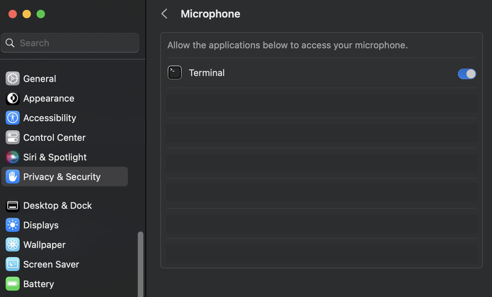

# Multilingual Dictation App based on Faster Whisper

This is based on the awesome work by https://github.com/guillaumekln/faster-whisper, https://github.com/foges/whisper-dictation and various PRs in the later repo

Multilingual dictation app based on the Faster Whisper to provide accurate and efficient speech-to-text conversion in any application. The app runs in the background and is triggered through a keyboard shortcut. It is also entirely offline, so no data will be shared. It allows users to set up their own keyboard combinations and choose from different Whisper models, and languages.

## Quick start
1. Run the app, switch to another application that accepts text input (editor, browser textarea, etc)
2. Use the key combination to toggle dictation.
(Default to double-triggering right-cmd on macOS and ctrl+alt on other platforms).
3. Say what you want to type, when done, use the same key combo (single click right-cmd on macOS and ctrl+alt on other platforms) to stop dictation and the app will transcribe and auto type the words on your behalf.

## Prerequisites
The PortAudio library is required for this app to work. You can install it on macOS using the following command:

```bash
brew install portaudio
```

## Permissions
The app requires accessibility permissions to register global hotkeys and permission to access your microphone for speech recognition.

For example, if you launch the app from MacOS terminal, you need to grant permission at Settings > Privacy & Security > Microphone
and Input Monitoring



## Installation
Clone the repository:

```bash
git clone https://github.com/doctorguile/faster-whisper-dictation.git
cd faster-whisper-dictation
```

Create a virtual environment:

```bash
python3 -m venv venv
source venv/bin/activate
```

Install the required packages:

```bash
pip install -r requirements.txt
```

## Usage
Run the application:

```bash
python dictation.py
```

By default, the app uses the "base" model and the key combination to toggle dictation is double click right cmd on macOS and ctrl+alt on other platforms. You can change the model and the key combination using command-line arguments.

You can check faster-whisper documentation for latest supported models: tiny, tiny.en, base, base.en, small, small.en, medium, medium.en, large-v1, large-v2, or large


```bash
python dictation.py -m large -k cmd_r+shift
```

#### Replace macOS default dictation trigger key
You can use this app to replace macOS built-in dictation. Trigger to begin recording with a double click of Right Command key and stop recording with a single click of Right Command key.
```bash
python whisper-dictation.py -m large --k_double_cmd 
```
To use this trigger, go to System Settings -> Keyboard, disable Dictation. If you double click Right Command key on any text field, macOS will ask whether you want to enable Dictation, so select Don't Ask Again.

## Setting the App as a Startup Item
To have the app run automatically when your computer starts, follow these steps:

 1. Open System Preferences.
 2. Go to Users & Groups.
 3. Click on your username, then select the Login Items tab.
 4. Click the + button and add the `run.sh` script from the faster-whisper-dictation folder.
